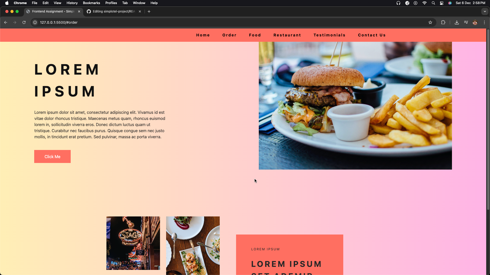
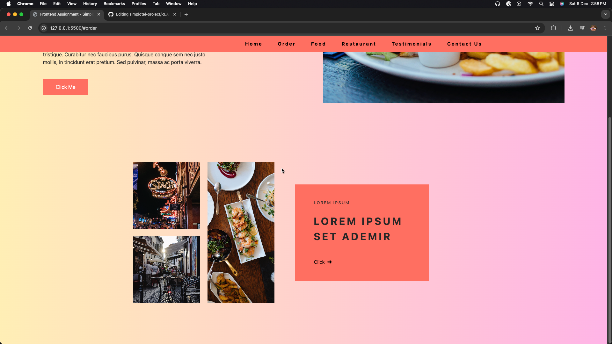
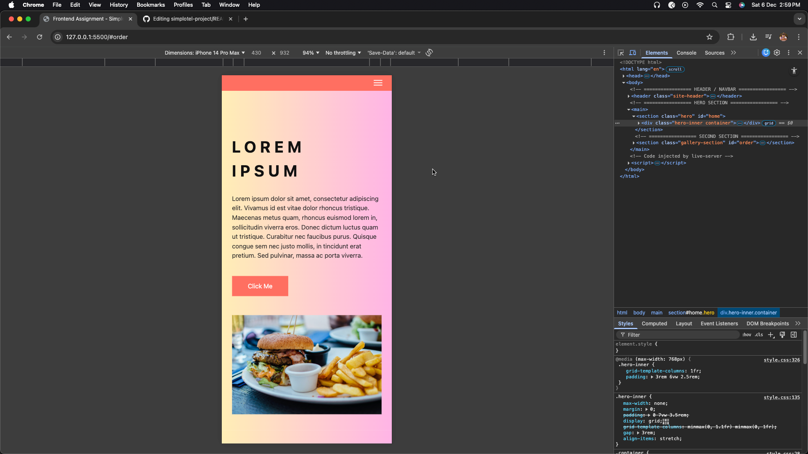
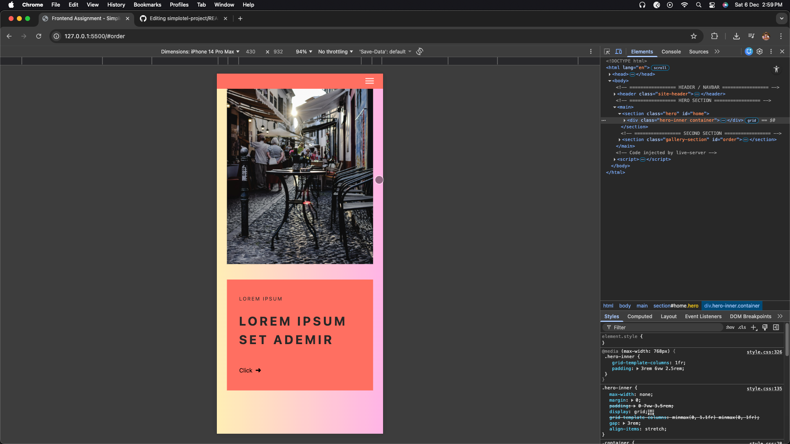
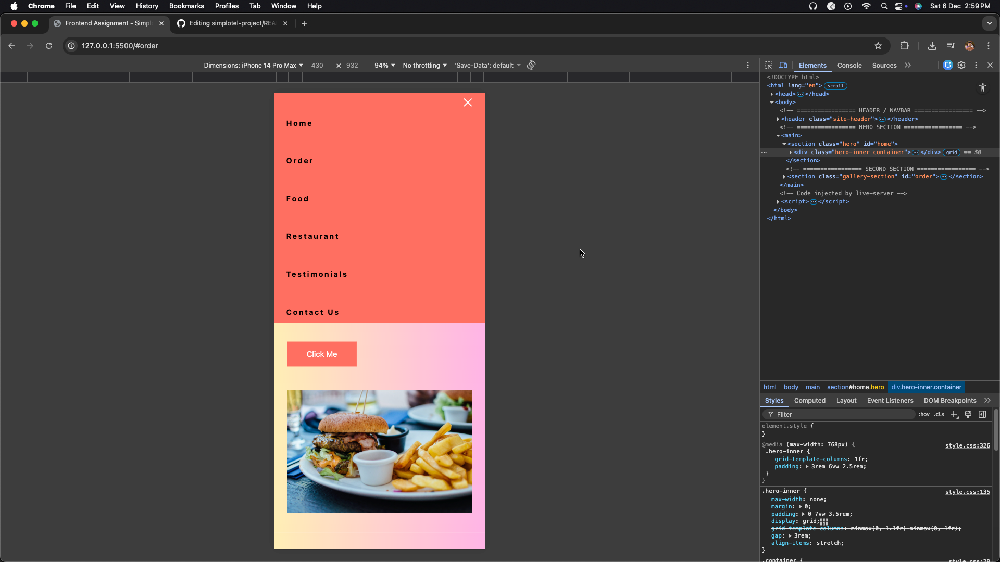

This project is a pixel-accurate implementation of the UI provided in the assignment PDF.
The task was to convert the given design into a responsive webpage using pure HTML & CSS without any frameworks or libraries, ensuring responsiveness across Desktop, Tablet & Mobile screens.

🔥 Features

Fully responsive layout (Desktop → Tablet → Mobile)

Pure HTML + CSS only

No Bootstrap, Tailwind, JS frameworks used

Mobile navigation with hamburger menu

Two main UI sections replicated from the assignment:

Hero section with gradient background & food banner image

Gallery section with 3-image grid + Coral highlight card

Works on zoom scaling & resizing without breaking layout

🛠 Tech Stack
Technology	Used For
HTML5	Structure & layout
CSS3	Styling & responsiveness
Responsive Media Queries	Mobile & tablet support
Flexbox + CSS Grid	Layout positioning
Github Pages / Live Server	Hosting/preview
📁 Folder Structure
📦 root-folder
├── index.html
├── style.css
└── /images
     ├── hero.jpg
     ├── img-1.jpg
     ├── img-2.jpg
     └── img-3.jpg

🔧 How to Run Locally
# Clone repository
git clone https://github.com/kamalkhandal23/simplotel-project

# Open folder
cd project

# Run
just open index.html in browser

(or use Live Server extension in VS Code)

🌍 Live Demo Link

🔗 [link](https://simplotel-project-virid.vercel.app/)

🔗 Repository Link: [Link](https://github.com/kamalkhandal23/simplotel-project)]

📸 Screenshots
🔹 Desktop View

🔹 Mobile View (Hamburger Menu Active)

Assignment Requirements Checklist ✔
Requirement	Status
Looks same as design	✔
Color scheme matched	✔
Fully responsive	✔
No frameworks used	✔
Images not stretched/pixelated	✔
Works on zoom & resizing	✔
Text doesn’t overflow	✔
Thank you!
